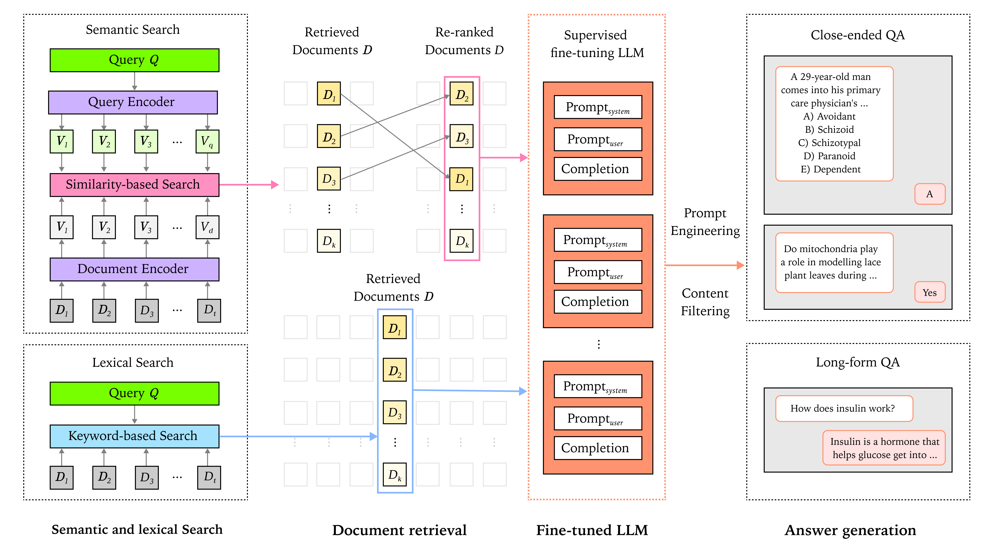
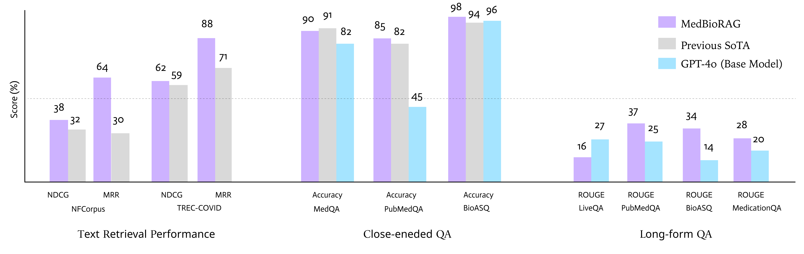

## 📌 MedBioRAG: Semantic Search & Retrieval-Augmented Generation for Biomedical QA



MedBioRAG is a **state-of-the-art system combining Semantic Search, Retrieval-Augmented Generation (RAG), and Fine-tuning** to enhance Large Language Model (LLM) performance in **biomedical question answering (QA)**.

📄 **This codebase supports the experiments in the paper**: [MedBioRAG: Semantic Search and Retrieval-Augmented Generation with Large Language Models for Medical and Biological QA](https://drive.google.com/file/d/1hm5hDRhJPmFjEBj_n9OUlWkQXoiEk2bH/view?usp=sharing)

---

## 🔍 Key Features



1. **Semantic Search**
   - Leverages **semantic relevance** between query and documents
   - Consistently outperforms traditional lexical search (see retrieval results)

2. **Retrieval-Augmented Generation (RAG)**
   - Generates **factual and context-aware answers** using retrieved documents
   - Fine-tuned GPT-4o enhances response accuracy

3. **Fine-Tuned Model for Improved Performance**
   - Trained on MedQA, BioSQA, PubMedQA, and other datasets
   - **Domain-specific knowledge adaptation** for consistency and factual accuracy

4. **Support for Multiple QA Tasks**
   - **Close-ended QA (multiple-choice, selection-based answers)**
   - **Long-form QA (detailed answer generation)**

---

## 📂 Dataset Preparation

Download and place the raw datasets in the appropriate folders:

| Task | Dataset | Link |
|------|---------|------|
| Close-ended QA | [MedQA](https://github.com/jind11/MedQA) | `data/close-ended/medqa/` |
| Close-ended QA | [PubMedQA](https://github.com/pubmedqa/pubmedqa) | `data/close-ended/pubmedqa/` |
| Close-ended QA | [BioASQ](https://participants-area.bioasq.org/) | `data/close-ended/bioasq/` |
| Long-form QA | [MedicationQA](https://github.com/abachaa/Medication_QA_MedInfo2019) | `data/long-form/medicationqa/` |
| Long-form QA | [LiveQA](https://github.com/abachaa/LiveQA_MedicalTask_TREC2017) | `data/long-form/liveqa/` |
| Long-form QA | [PubMedQA (LF)](https://github.com/pubmedqa/pubmedqa) | `data/long-form/pubmedqa/` |
| Retrieval | [NFCorpus](https://www.cl.uni-heidelberg.de/statnlpgroup/nfcorpus/) | `data/retrieval/nfcorpus/` |
| Retrieval | [TREC-COVID](https://ir.nist.gov/trec-covid/) | `data/retrieval/trec-covid/` |

You can run the scripts under each data folder (e.g. `bioasq.py`, `nfcorpus.py`) to convert raw files into `.csv`/`.jsonl` format.

---

## 📊 Evaluation

All evaluation scripts are located under `evaluation/`.

### 🔹 Close-ended QA
```bash
eval_close-ended.py
```
- Evaluates MCQ and classification models on MedQA, BioASQ, PubMedQA
- Metrics: Accuracy

### 🔹 Long-form QA
```bash
eval_long-form.py
```
- Evaluates generative QA on LiveQA, MedicationQA, PubMedQA, BioASQ
- Metrics: ROUGE, BLEU, BERTScore, BLEURT

### 🔹 Retrieval
```bash
eval_retrieval.py
```
- Evaluates Azure Semantic Search performance on NFCorpus, TREC-COVID
- Metrics: DCG@10, NDCG@10, MRR@10, Precision/Recall@10, MAP@10

Make sure to define `.env` variables for `AZURE_OPENAI_API_KEY`, `AZURE_SEARCH_API_KEY`, and respective endpoints.

---

## 🧪 Experimental Results

### ✅ Close-ended QA

| Model | MedQA | PubMedQA | BioASQ |
|-------|-------|----------|--------|
| Fine-Tuned GPT-4o | 87.88 | 80.70 | 97.06 |
| + MedBioRAG | **89.47** | **85.00** | **98.32** |
| GPT-4o | 81.82 | 44.74 | 96.12 |
| + MedBioRAG | 86.86 | 66.67 | 97.06 |
| GPT-4o-mini | 67.68 | 77.55 | 97.06 |
| + MedBioRAG | 70.71 | 76.32 | 97.06 |
| GPT-4 | 66.67 | 52.63 | 96.32 |
| + MedBioRAG | 78.79 | 72.81 | 97.79 |
| GPT-3.5 | 51.52 | 19.30 | 88.24 |
| + MedBioRAG | 45.36 | 38.60 | 66.91 |

### 🔍 Document Retrieval

| Dataset | Metric | Lexical | Semantic |
|---------|--------|---------|----------|
| **NFCorpus** | DCG@10 | 2.65 | 3.27 |
|             | NDCG@10 | 31.34 | 37.91 |
|             | MRR@10 | 51.63 | 64.29 |
|             | Precision@10 | 23.04 | 27.88 |
|             | Recall@10 | 15.95 | 18.70 |
|             | MAP@10 | 46.01 | 56.15 |
| **TREC-COVID** | DCG@10 | 4.39 | 5.55 |
|             | NDCG@10 | 48.35 | 61.02 |
|             | MRR@10 | 82.50 | 89.17 |
|             | Precision@10 | 49.60 | 64.20 |
|             | Recall@10 | 0.43 | 0.54 |
|             | MAP@10 | 72.31 | 82.19 |


---

## 📢 Questions & Feedback

If you have any questions, suggestions, or improvements, feel free to open an **Issue** or submit a **Pull Request**.

---

